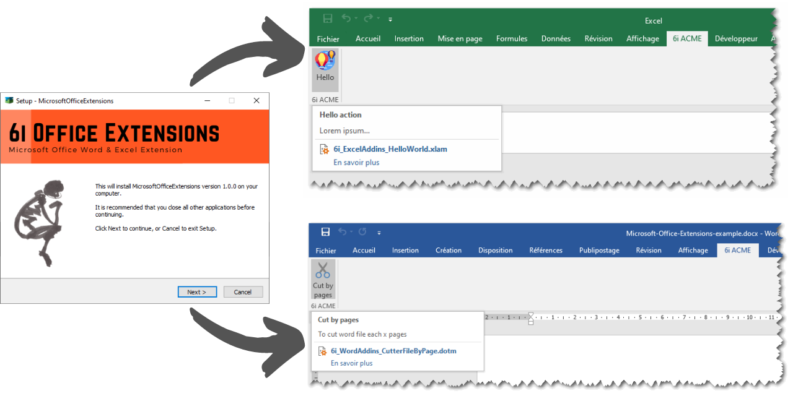

Deploy Microsoft Office Extensions
==================================

  

> Helper to deploy Microsoft Office Extensions, like Excel or Word VBA macros, add custom actions in Office Ribbon, with InnoSetup. We use this solution in order to make easy installation and deployment of VBA macros stored in *.xlam or *.dotm files.

## Features

The deployment of addins and extensions of Microsoft Office Word & Exel, depends on shared libraries and VBA macro ... can be hard.

 - Install Excel addins on a PC client. Excel macro must be stored in a *.xlam file, and saved in the appropriate folder. By convention, all Excel addins are saved in : `c:\users\[name]\AppData\Roaming\Microsoft\AddIns\` ;
 - Activates automatically all Excel addins, by updating the Windows registry.
 - Install Word addins on a PC client. Word macro must be stored in a *.dotm file. In order to use shared Word VBA macro in all Word files, we have choosen to saved *.dotm file in this folder : `c:\users\[name]\AppData\Roaming\Microsoft\Word\STARTUP\` 
 - Give a process to customize the Excel ribbon and Word ribbon for making easy interactions with office extensions.     

## Usages

 - [How to generate a new setup ?](./doc/how-to-generate-new-setup.md)
 - [How to add new Microsoft Office extensions (Excel, Word) in setup ?](./doc/how-to-add-new-Microsoft-Office-extensions-in-setup.md)
 - [how to customize the ribbon in Excel Or Word ?](./doc/how-to-customize-the-ribbon-in-Excel-or-Word.md)
 

## About

### Credits

This project is inspired by the work of [Daniel Kraus](http://github.com/bovender), with [ExcelAddinInstaller](https://github.com/bovender/ExcelAddinInstaller). More informations about how he used InnoSetup to install Excel Addins [here](https://www.xltoolbox.net/blog/2013/12/using-innosetup-to-install-excel-addins.html). 

Deploy Microsoft Office Extensions depends on :

- Microsoft®, Windows®, Office®, and Excel® are either registered trademarks or trademarks of Microsoft Corporation in the United States and/or other countries.
- InnoSetup v6, JRSoftware (https://jrsoftware.org/isinfo.php)

### License

Copyright (c) 6i by 2o1oo <vb20100bv@gmail.com>
Release under [MIT](./LICENSE.md) license.

