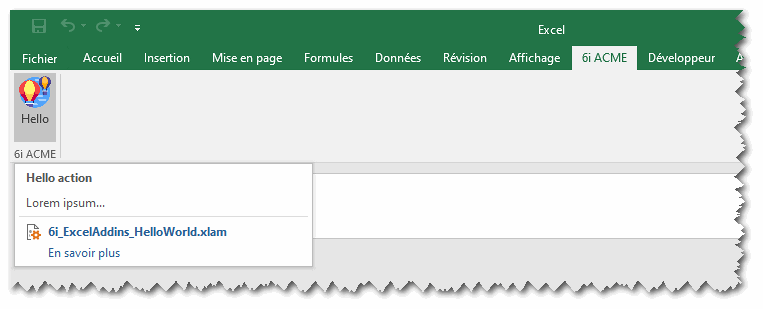
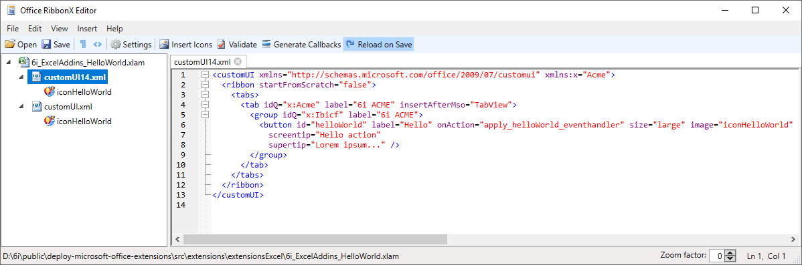

Deploy Microsoft Office Extensions
==================================

## How to customize the ribbon in Excel Or Word ?

 

### Install Office RibbonX Editor

Install and launch Office RibbonX Editor (https://github.com/fernandreu/office-ribbonx-editor). You can find a version in `.\bin\` folder. It's a standalone tool to edit the Custom UI part of Office open document file format. It contains both Office 2007 and Office 2010 custom UI schemas.

### Add a custom UI schema in _*.xlam_ or _*.dotm_ file

In order to add a custom UI schema, just open file in Office RibbonX Editor. For exemple open the Excel Addins `6i_ExcelAddins_HelloWorld.xlam` into it. As you can see bellow, you find two custom UI schemas for two Excel version. You can make the same, with a _*.dotm_ file.

 

See the Custom UI schema for Office 2010 (customUI14.xml) :

```xml
<customUI xmlns="http://schemas.microsoft.com/office/2009/07/customui" xmlns:x="Acme">
  <ribbon startFromScratch="false">
    <tabs>
      <tab idQ="x:Acme" label="6i ACME" insertAfterMso="TabView">
        <group idQ="x:Ibicf" label="6i ACME">
          <button id="helloWorld" 
                  label="Hello" 
                  onAction="apply_helloWorld_eventhandle" 
                  size="large"
                  image="iconHelloWorld"
                  screentip="Hello action"
                  supertip="Lorem ipsum..." />
        </group>
      </tab>
    </tabs>
  </ribbon>
</customUI>
```

Few comments about this xml file :
- The first line defines the custom UI schema ;
- In the _&lt;tab&gt;_ element, the attribute `idQ="x:Acme"` is used to define a namespace. So in another xlam file, you can use the same namespace to add another element, in the same tab ;
- You can add an icon, based on an external image, on button, defines with `image` attribute. Just make a right click on customUI14.xml in Office RibbonX Editor, and choose `Insert icons...`. So the added image is insert into zip containers of this xaml file.

### Linked a VBA function to a button in ribbon

In order to execute a VBA function, when the user click on a button in ribbon, You must create a function that respect a correct signature. Give it, ability to make your function callable from the UI application Ribbon Excel like this :
 
```vba
Sub apply_helloWorld_eventhandler(control As IRibbonControl) 
    MsgBox "I believe I can fly !"
End Sub
```

And finally, change the attribute `onAction` in Custom UI schema with the name of this function.

```xml
<button onAction="apply_helloWorld_eventhandle" />
```

_Here we go !_

### More information 

 - https://www.rondebruin.nl/win/s2/win001.htm
 - https://github.com/fernandreu/office-ribbonx-editor

<br>

Back to [README](../README.md).