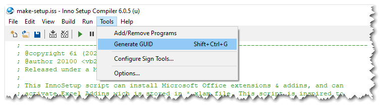
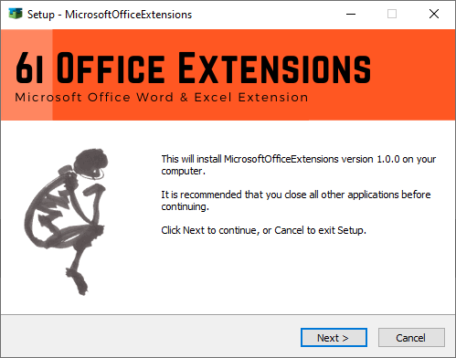
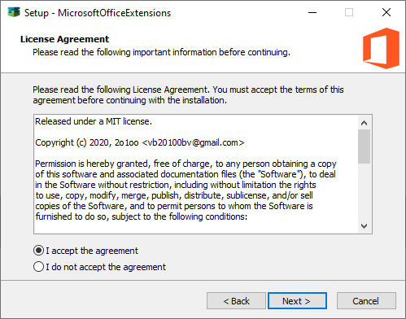
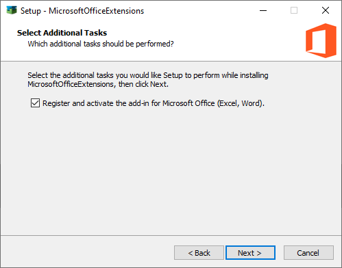

Deploy Microsoft Office Extensions
==================================

## How to generate a new setup ?

### Install Inno Setup

Install InnoSetup compiler (v.6) : https://jrsoftware.org/isinfo.php

Open the `.\src\InnoSetup\make-setup.iss` InnoSetup script file, into IDE.

### Change the GUID of your setup (only once)

In order to have an id that uniquely identifies your application. Please don't forget to generate a new GUID inside the InnoSetup IDE by clicking 'Tools > Generate GUID', and change the variable `{#AppGUID}` with this value. Once you have this new GUID, do not change it ! Otherwise, it will no longer be possible to find the entries in the Windows registry.



```iss
; The value of AppId uniquely identifies this application. Do not use the same AppId value
; in installers for other applications. To generate a new GUID inside the InnoSetup IDE,
; click Tools and choose Generate GUID.
#define AppGUID "{INSERT_NEW_GUID_HERE}"
#define AppID "6i_MOExtensions_" + AppGUID
``` 

### Launch build compilation of `make-setup.iss`
 
Launch build compilation of `.\src\InnoSetup\make-setup.iss` InnoSetup script file.
Setup is saved into folder `.\release\vx.y.z` folder, and depends on variables `AppVersion` and `AppName` defines in `make-setup.iss`. 

### Result

You can click on green start button in IDE to launch this setup built. 







<br>

Back to [README](../README.md).